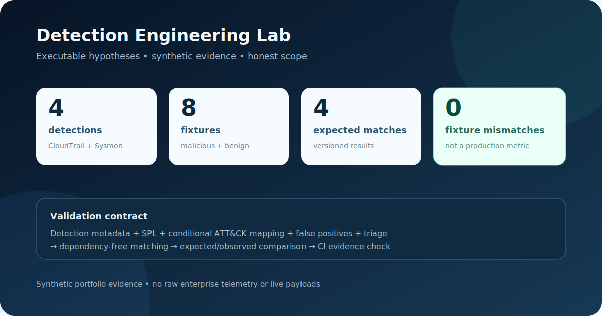
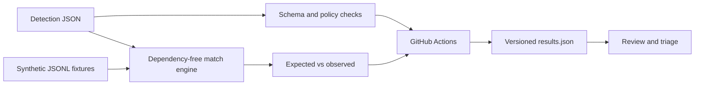

# Detection Engineering Lab

[](https://github.com/PeteAndrews1289/detection-engineering-lab/actions/workflows/validate.yml)

Tested detection hypotheses for AWS CloudTrail and Windows Sysmon, expressed as structured metadata, executable matching logic, SPL examples, synthetic fixtures, and analyst triage guidance.

> **Scope:** this is a portfolio-scale validation harness, not a production SIEM content pack. The current results prove deterministic behavior against eight synthetic fixtures; they do not establish real-world precision, recall, coverage, or tuning quality.



## Evidence at a glance

| Measure | Current result |
| --- | ---: |
| Structured detections | 4 |
| Synthetic malicious and benign fixtures | 8 |
| Expected matches | 4 |
| Fixture false positives | 0 |
| Fixture false negatives | 0 |
| External Python packages | 0 |

The checked-in [validation result](evidence/results.json) is regenerated from the catalog and compared in CI so documentation cannot quietly drift from executable behavior.

## Detection catalog

| ID | Data source | Hypothesis | Initial severity | ATT&CK starting point |
| --- | --- | --- | --- | --- |
| [`AWS-IAM-001`](detections/aws/iam_privilege_change.json) | CloudTrail | IAM permission expansion | High | T1098.003 |
| [`AWS-ROOT-001`](detections/aws/root_account_usage.json) | CloudTrail | Root-account API activity | High | T1078.004 |
| [`ENDPOINT-PS-001`](detections/endpoint/powershell_encoded_command.json) | Sysmon Event 1 | Suspicious PowerShell command features | Medium | T1059.001 |
| [`ENDPOINT-LSASS-001`](detections/endpoint/lsass_process_access.json) | Sysmon Event 10 | Unusual LSASS process access | High | T1003.001 |

The mappings are conditional. An API name, PowerShell process, or LSASS access event does not prove adversary behavior on its own; each detection records when the ATT&CK mapping is appropriate.

## Validation flow



Every detection contains:

- an explicit data source and severity;
- a portable SPL example requiring a configured index;
- executable matching conditions;
- a conditional ATT&CK mapping;
- known false-positive causes;
- analyst triage steps; and
- malicious and benign regression fixtures.

## Run locally

Python 3.10 or newer is sufficient; no installation step is required.

```bash
python3 -m unittest discover -s tests -v
python3 tools/validate_detections.py --check-results
```

To intentionally refresh the evidence after changing a fixture or detection:

```bash
python3 tools/validate_detections.py --write-results
git diff -- evidence/results.json
```

## Add a detection

1. Add one JSON document under `detections/aws` or `detections/endpoint`.
2. Include a constrained SPL example—`index=*` is rejected.
3. Explain the ATT&CK mapping condition, false positives, and triage path.
4. Add at least one malicious and one benign synthetic fixture with expected IDs.
5. Regenerate the evidence and run the tests.

## Migrated endpoint work

The PowerShell and LSASS hypotheses and their analyst questions originated in the earlier `endpoint-detection-lab` planning repository. They were migrated here because the former repository contained only untested Markdown. This implementation converts the useful ideas into structured, regression-tested artifacts while preserving the original caution that environment-specific baselining is required. See [Analyst triage playbooks](docs/triage/playbooks.md).

## What this does not claim

- The synthetic fixtures are not raw production or customer telemetry.
- Zero fixture errors do not mean zero operational false positives.
- SPL field names may require adaptation for a real Splunk deployment.
- No detection has been promoted beyond `experimental`.
- The harness does not execute SPL inside Splunk; it validates equivalent structured conditions.
- Containment is deliberately outside this repository and must remain authenticated, auditable, and human-approved.

## Next evidence milestone

The next credible expansion is not a larger detection count. It is a replayable, sanitized dataset with time-window correlations, threshold tuning, explicit negative cases, and measured precision/recall—followed by integration with the corrected SOAR incident-state workflow.

## Responsible use

Fixtures use synthetic identities, documentation-only IP ranges, and nonfunctional command values. Do not commit raw enterprise logs, credentials, access-key identifiers, personal data, or live offensive payloads.
